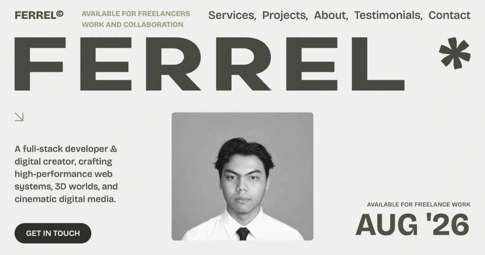

# Ferrel Rashad Akeyla — Digital Portfolio (v2)

<div align="center">
  <h3>⚡ Full-Stack Developer • Machine Learning Enthusiast • 3D & Game Creator ⚡</h3>
  <p>Crafting high-performance web systems, interactive physics-driven experiences, and scalable data solutions.</p>

  <p>
    <a href="https://github.com/FerrelHD"></a>
    <a href="https://www.linkedin.com/in/ferrel-rashad-8a165514b/"></a>
    <a href="mailto:ferrelrashadakeyla2014@gmail.com"></a>
  </p>

  <br />

  
</div>

---

## 🌟 Overview

Welcome to my personal digital portfolio repository. This project showcases my multi-disciplinary engineering capabilities spanning **modern full-stack web applications**, **quantitative machine learning models**, and **interactive 3D simulations**.

Built with a focus on fluid 60 FPS motion, responsive macOS-style browser mockups, and type-safe architecture.

---

## 🛠️ Tech Stack & Arsenal

### 1. **Frontend & Motion Engineering**
- **Frameworks & Libs:** Vue 3 (Composition API), React 19, Next.js, TypeScript
- **Animation & Motion:** GSAP (ScrollTrigger & Timeline Animations), Framer Motion, Lenis Smooth Scroll
- **Styling:** Tailwind CSS, PostCSS, Custom Vector SVG Design

### 2. **Backend & Machine Learning Systems**
- **Languages & Frameworks:** Python, Laravel 11, Node.js, Express, Streamlit
- **ML & Data Science:** XGBoost, LightGBM, Scikit-Learn, Pandas, NumPy
- **Databases & Cloud:** Supabase, PostgreSQL, MySQL, REST APIs

### 3. **3D Modeling & Game Development**
- **Engines & Tools:** Unity 3D (C#), Blender 3D, Roblox Studio (Luau)
- **Creative Media:** Sony Vegas Pro, Premiere Pro, Audio Synthesis & Web Audio API

---

## 🚀 Featured Projects

| Project | Category | Tech Stack | Status |
| :--- | :--- | :--- | :--- |
| **[Charles Leclerc #16](https://leclerc-redline.vercel.app/)** | Creative Frontend & Motion Physics | React 18, GSAP, Canvas 2D, Framer Motion | [Live Demo](https://leclerc-redline.vercel.app/) |
| **[Stock Prediction ML](https://github.com/FerrelHD/Stock-Prediction-System)** | Quant ML & Web Analytics | Python, Streamlit, XGBoost, LightGBM | [Source Code](https://github.com/FerrelHD/Stock-Prediction-System) |
| **[Spider-Dev Portfolio](https://github.com/FerrelHD/Portofolio)** | Creative Frontend & Web Audio | React 19, GSAP, Tailwind CSS, Web Audio | [Live Repo](https://github.com/FerrelHD/Portofolio) |
| **[Student Life](https://ferrelhd.github.io/Student-Life/)** | Productivity Web App | React 19, TypeScript, Supabase, Tailwind | [Live Demo](https://ferrelhd.github.io/Student-Life/) |
| **[Fersya Shop](https://github.com/FerrelHD/Fersya-Shop)** | Organic E-Commerce Store | Laravel 11, Filament Admin, Tailwind CSS | [Source Code](https://github.com/FerrelHD/Fersya-Shop) |
| **[Finesser Shop](https://github.com/FerrelHD/Finesser-Shop)** | Digital Assets Storefront | Laravel, Bootstrap, MySQL | [Source Code](https://github.com/FerrelHD/Finesser-Shop) |
| **[Street Rush](https://github.com/FerrelHD/Street-Rush-Unity)** | 3D Arcade Runner Game | Unity, C#, Mobile 3D Physics | [Unity Repo](https://github.com/FerrelHD/Street-Rush-Unity) |
| **[Gunung Gede Simulation](https://www.roblox.com/games/125712163693709/Mount-Gede-Via-Gunung-Putri)** | 3D Hiking Trail Simulation | Luau, Roblox Studio, Terrain Modeling | [Play Roblox](https://www.roblox.com/games/125712163693709/Mount-Gede-Via-Gunung-Putri) |

---

## 💻 Local Development Setup

To run this portfolio locally on your machine:

```bash
# 1. Clone the repository
git clone https://github.com/FerrelHD/portfolio-v2.git

# 2. Navigate to project root
cd portfolio-v2

# 3. Install dependencies
npm install

# 4. Start local development server
npm run dev
```

The application will be accessible at `http://localhost:5173/`.

---

## 📦 Build for Production

```bash
npm run build
```

---

## 🎨 Acknowledgments & Credits

- **UI/UX Design Inspiration:** [Huy Nguyen](https://www.huyng.xyz)
- **Base Animation Architecture:** Adapted and customized from [Ebraheem Alhetari](https://github.com/Hetari/portfolio)

---

<div align="center">
  <p>© 2026 <strong>Ferrel Rashad Akeyla</strong>. Built with precision and passion.</p>
</div>
